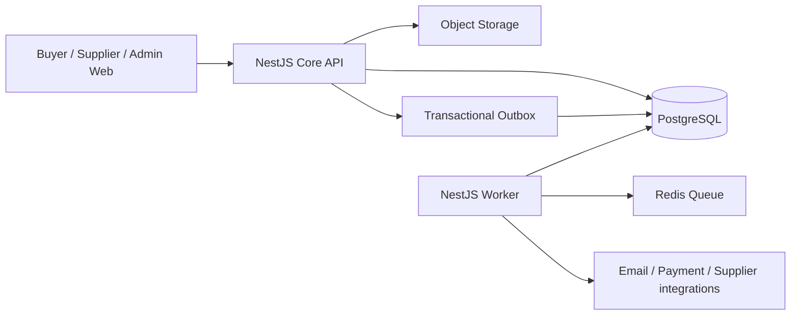

# DentMarket KZ — фундамент backend V2

Статус: рабочий технический документ

Дата аудита: 3 августа 2026

Ветка: `recovery/gate-0`

Базовый коммит аудита: `1b6da4c`

## 1. Решение

Backend **не нужно переписывать с нуля**. Стек и значительная часть доменной логики пригодны для развития. Нужна контролируемая стабилизация существующего модульного монолита:

1. зафиксировать узкое ядро пилота;
2. сделать API-контракт машиночитаемым;
3. отделить HTTP API от фоновых работ;
4. доказать основной путь покупки интеграционными тестами на PostgreSQL;
5. заморозить enterprise-функции до готовности ядра;
6. только после этого унифицировать buyer/supplier/admin UI вокруг стабильного API.

Переписывание сейчас уничтожит уже реализованные транзакции, права доступа, миграции, проверки договоров, compliance, резервы и идемпотентность, но не решит главную продуктовую проблему — отсутствие жёсткого приоритета и критериев готовности.

## 2. Целевое назначение backend

DentMarket — B2B-маркетплейс стоматологических товаров Казахстана. Backend должен обеспечить три основных роли.

### Клиника

- войти в организацию с корректными правами;
- найти товар в едином каталоге;
- сравнить актуальные предложения поставщиков;
- положить предложение в корзину;
- оформить заказ без двойного списания и двойного резерва;
- видеть статус заказов и документов.

### Поставщик

- пройти допуск к маркетплейсу;
- сопоставить свой товар с канонической карточкой;
- опубликовать цену и остаток;
- получить заказ;
- подтвердить доступное количество;
- передать заказ в исполнение.

### Оператор площадки

- управлять организациями и доступами;
- модерировать каталог и поставщиков;
- контролировать договоры и compliance;
- видеть ошибки интеграций и незавершённые операции;
- иметь полный audit trail критичных действий.

## 3. Проверенный снимок текущего backend

Аудит выполнен по коду, Prisma-схеме, тестам и живому локальному API, а не по статусам в старом ТЗ.

| Область | Фактическое состояние |
|---|---:|
| Архитектура | NestJS-модульный монолит |
| База | PostgreSQL + Prisma |
| Доменные модули | 29 |
| Prisma-модели | 148 |
| Prisma-enum | 116 |
| Миграции | 28 |
| Контроллеры | 41 |
| HTTP operations в OpenAPI | 287 |
| Сервисные файлы | 73 |
| API spec-файлы | 32 |
| Тесты API в текущем suite | 99, один Docker-тест пропускается без Docker |
| Плановые задачи внутри API | 6 |
| Пилотный каталог | 500 активных карточек |
| Покупаемая часть | 50 товаров, 500 офферов |
| Пилотные стороны | 10 клиник, 10 поставщиков |

Живой acceptance-flow прошёл: `health → readiness → каталог → сравнение 10 офферов → корзина → checkout → supplier order → inventory reservation → повтор checkout с тем же idempotency key`.

## 4. Что в текущей реализации уже хорошо

### Стек подходит

- `pnpm` корректно подходит для monorepo и не является риском для production.
- NestJS подходит для большого доменного backend с RBAC, модулями и фоновыми задачами.
- Prisma и PostgreSQL подходят для транзакционной B2B-торговли.
- Next.js подходит для buyer, supplier и admin приложений. Разный UI сейчас — проблема дизайн-системы и организации frontend, а не ограничение Next.js.
- Turbo подходит для сборки нескольких приложений; последовательная production-сборка уже используется для устойчивости по памяти.

Переход на npm, другой backend framework или микросервисы сейчас не даст продуктовой выгоды.

### Доменное ядро не является пустой заготовкой

В `CommerceService` реализованы:

- проверка buyer-организации и доступа оператора;
- проверка активного договора поставщика с маркетплейсом;
- проверка публикации оффера, валюты, цены и количества;
- контроль минимальной партии и шага заказа;
- выбор свежего остатка и FEFO-лота;
- транзакционное создание checkout и заказов по поставщикам;
- резервирование остатка;
- компенсация резервов и перевод checkout в `FAILED` при ошибке;
- идемпотентность checkout;
- outbox- и audit-события.

### Безопасность имеет реальный фундамент

- В development identity может задаваться заголовками для локальной разработки.
- В JWT-режиме входящие identity-заголовки удаляются и формируются из проверенного токена.
- Есть issuer/audience/algorithm constraints и режим обязательного MFA.
- Tenant-доступ проверяется через membership, role и permission.
- Публичные webhook/callback endpoints имеют отдельные механизмы подписи или токена.
- Production-конфигурация запрещает development auth и требует ключевые security-параметры.

### Инфраструктурные паттерны уже присутствуют

- Prisma migrations;
- audit log;
- inbox/idempotency для webhook;
- outbox-события в доменных транзакциях;
- readiness для PostgreSQL, очереди и object storage;
- локальный и production storage drivers;
- структурированные логи.

## 5. Главные технические проблемы

### P0. Нет реальной границы пилота

`DEPLOYMENT_PROFILE=pilot` валидируется, но почти не меняет состав приложения. `AppModule` поднимает все 29 доменных модулей. Вместе с HTTP API запускаются плановые процессы agreements, compliance, integrations, notifications, payment retry и search projection.

Последствия:

- невозможно доказать, что пилот зависит только от согласованного ядра;
- ошибка во второстепенной enterprise-функции может уронить основной API;
- запуск и диагностика сложнее;
- несколько экземпляров API одновременно запускают фоновые циклы;
- партнёр может случайно расширять scope вместо завершения покупки.

Решение: ввести явные `CoreMarketplaceModule`, `OperationsModule`, `EnterpriseModule` и runtime-role `api | worker | all`. На первом этапе не удалять код — отключить необязательные runtime-функции в пилоте и заморозить их развитие.

### P0. OpenAPI не является контрактом frontend/backend

В исходном живом Swagger-документе было обнаружено 287 operations, но:

- `requestBody` описан у 0 operations;
- JSON response schema описана только у одного успешного ответа;
- component schemas отсутствуют.

Этот baseline устранён для основного потока в B0.2: теперь зарегистрирована 21 именованная component schema, 16 core operations имеют проверенные response contracts, четыре изменяющих endpoint имеют request body contracts, а стандартный error envelope проверяется живым запросом. Остальной широкий API по-прежнему переводится на контракты только по мере попадания в согласованный scope.

Zod действительно валидирует многие запросы во время выполнения, но frontend, QA и Codex не могут по OpenAPI узнать форму запроса и ответа. В итоге интеграция строится по чтению контроллеров, ручным типам и догадкам.

Решение:

- сохранить Zod как единый источник правил;
- генерировать из него JSON/OpenAPI schemas либо ввести явные transport DTO;
- не поддерживать две независимые схемы вручную;
- сначала покрыть 12–20 endpoints основного потока, затем остальной API;
- генерировать typed API client для web-приложений;
- проверять breaking changes в CI.

### P0. API одновременно является worker

При отключённом Redis сервисы переходят на inline/database fallback, но cron-задачи продолжают работать в API-процессе. Сейчас это удобно локально, но опасно как production-модель.

Целевая модель:



API и worker могут оставаться двумя entrypoint одного репозитория и одного модульного монолита. Микросервисы пока не нужны.

### P0. До текущего изменения не было воспроизводимого доказательства покупки

Старый `verify:search-commerce` использовал legacy slug и фиксированные UUID старого seed. После перехода на чистый каталог он не доказывал работоспособность.

Добавлен `pnpm verify:pilot-backend`, который:

- собирает API;
- сам запускает его на отдельном порту;
- проверяет readiness;
- динамически находит пилотный товар и офферы;
- проверяет сортировку сравнения;
- создаёт корзину, checkout, заказ и резерв;
- проверяет идемпотентность;
- сверяет итог с PostgreSQL;
- останавливает API после проверки.

Gate намеренно разрешён только для локальной БД, потому что создаёт один демо-заказ при каждом запуске.

### P1. Outbox не имеет единой семантики обработки

Доменные сервисы корректно пишут много типов `OutboxEvent` транзакционно. Но обнаруженный dispatcher явно публикует только `PaymentCaptured`. Notifications отдельно сканируют недавние события и делают idempotent upsert. Для остальных событий статус `PENDING` может остаться навсегда.

Нужно принять одно решение:

1. `OutboxEvent` — очередь доставки: тогда у каждого типа должен быть consumer, retry, dead-letter и финальный статус;
2. это event log: тогда статус публикации не должен вводить в заблуждение;
3. практичный вариант — разделить `DomainEventLog` и `IntegrationOutbox`.

До решения нельзя строить новые интеграции поверх текущего `PENDING` как будто доставка гарантирована.

### P1. Тесты смещены в unit-уровень

99 API-тестов — хороший задел, но большая часть проверяет изолированные правила. Самая рискованная логика находится на границах:

- параллельное создание активной корзины;
- два одновременных checkout;
- гонка за последним остатком;
- ошибка после DB-транзакции во внешнем резерве;
- повтор webhook;
- повтор worker-задачи;
- tenant isolation.

PostgreSQL concurrency test существует, но пропускается без Docker. Нужен обязательный integration-suite против отдельной PostgreSQL test database. Docker может быть одним из способов, но не должен быть единственным способом локальной проверки на Windows.

### P1. Seed смешивает базовую платформу и пилот

Активный пилотный каталог содержит ровно 500 карточек, но в физической таблице `Product` после базового seed остаются ещё 5 legacy fixtures. Это не ломает публичный каталог, однако размывает понятие «чистой базы».

Нужно разделить профили:

- `seed:reference` — страны, города, units, permissions;
- `seed:operator` — локальный оператор;
- `seed:pilot` — 10 клиник, 10 поставщиков, 500 карточек, 500 офферов;
- `seed:test` — минимальные фиксированные fixtures для integration tests.

Каждый профиль должен иметь manifest и проверяемые counts.

### P1. Слишком большие сервисы и широкий домен

Примеры размеров:

- imports service — около 1200 строк;
- integration execution — около 1100 строк;
- search service — около 850 строк.

Это не повод массово переписывать их. Декомпозиция выполняется только при работе над конкретным потоком: orchestration отделяется от policy, persistence adapter и provider adapter. Рефакторинг без acceptance-test запрещён.

### P1. Наблюдаемость пока не определяет эксплуатационную готовность

Наличие structured logs, Sentry и OTEL-параметров — фундамент, но не SLO. Для пилота нужны минимум:

- request/correlation ID от HTTP до outbox/worker;
- latency и error rate основных endpoints;
- число `FAILED` checkout;
- возраст старейшего outbox event;
- глубина retry/dead-letter;
- доля stale inventory;
- число заказов без резерва;
- backup/restore runbook и проверка восстановления.

### P2. Нет согласованной политики API lifecycle

Перед подключением внешних клиентов нужно зафиксировать:

- единый error envelope;
- правила pagination/filter/sort;
- date/time и money representation;
- idempotency policy;
- deprecation policy;
- API versioning.

Не следует немедленно механически переносить 287 operations в `/api/v1`. Сначала стабилизируется контракт core endpoints, затем вводится версия без массового бессмысленного churn.

## 6. Целевая граница пилота

### Обязательное ядро

1. Identity, organizations, membership, RBAC.
2. Canonical catalog, categories, search, media.
3. Suppliers, marketplace agreement, offer publication.
4. Price, fresh inventory, inventory reservation.
5. Cart, checkout, supplier order.
6. Minimal documents and notifications.
7. Audit log, integration inbox/outbox, health/readiness.

### Разрешено только как зависимость ядра

- минимальный compliance, реально блокирующий публикацию или покупку;
- минимальный logistics status;
- mock payment только для демонстрации сценария;
- imports только для загрузки пилотных данных.

### Заморозить до доказанного пилота

- AI-функции;
- сложный billing;
- promotions;
- расширенные trust/reputation механики;
- сложные approval chains;
- широкий набор внешних коннекторов;
- enterprise support automation;
- внешние платежи и EDS до отдельной интеграционной готовности.

«Заморозить» означает не удалять, а не добавлять функции и не связывать с ними основной checkout без отдельного решения.

## 7. Backend Definition of Done

Задача backend считается готовой, только если одновременно выполнено следующее:

- описан один пользовательский сценарий и его non-goals;
- есть Zod/DTO request schema;
- есть явная response schema;
- endpoint отражён в OpenAPI;
- tenant и permission checks проверены тестом;
- критичная запись выполняется транзакционно;
- повтор запроса безопасен там, где возможен retry;
- создаются необходимые audit/outbox события;
- ошибки имеют стабильные machine-readable codes;
- unit tests проходят;
- integration test на PostgreSQL проходит;
- основной acceptance-gate не регрессировал;
- миграция имеет путь deploy и rollback/forward-fix;
- документация обновлена в том же коммите.

Наличие контроллера или UI-кнопки не означает готовность функции.

## 8. План реализации

### B0 — стабилизация фундамента

Цель: сделать текущее ядро измеримым и безопасным для дальнейшей работы.

| Готово | ID | Задача | Результат | Gate |
|---|---|---|---|---|
| [x] | B0.1 | Живой pilot backend flow | Динамический тест покупки | `pnpm verify:pilot-backend` |
| [x] | B0.2 | Core API contract | Полные schemas для catalog/compare/cart/checkout/orders | `pnpm verify:core-contract` |
| [ ] | B0.3 | Runtime split | API не запускает worker jobs; worker имеет отдельный entrypoint | process-level smoke tests |
| [ ] | B0.4 | PostgreSQL integration suite | Concurrency, rollback, idempotency, tenant isolation | обязательный CI job |
| [ ] | B0.5 | Seed profiles | reference/operator/pilot/test разделены | manifest/count assertions |
| [ ] | B0.6 | Outbox ADR | Однозначные delivery/status/retry правила | dispatcher tests |

Выполнено в B0.2:

- [x] Shared Zod response schemas для health, catalog, comparison, cart, checkout и supplier orders.
- [x] Отдельные типы сырого HTTP request и нормализованного service input.
- [x] OpenAPI 3.1 components и `$ref` для 16 операций основного потока.
- [x] Request body, query, path parameter, bearer auth и error schemas.
- [x] Единый безопасный error envelope с `code`, `requestId`, `path` и `details`.
- [x] Типизированные методы core-flow в общем `@marketplace/api-client`.
- [x] Contract-only gate без создания заказа.
- [x] Runtime-валидация реальных response payloads shared-схемами.
- [x] Проверка contract gate в GitHub CI.
- [x] Полный purchase gate после изменения контрактов.

Текущий статус: **B0.1 и B0.2 реализованы и проходят**. Следующая задача: **B0.3 Runtime split**.

### B1 — покупка клиникой

Зафиксировать один безусловно рабочий путь:

1. поиск;
2. карточка;
3. сравнение;
4. корзина;
5. checkout;
6. заказ;
7. видимый статус.

Gate: одна клиника оформляет заказы у одного и нескольких поставщиков; повтор и конкурентный запрос не создают дублей и не делают остаток отрицательным.

### B2 — исполнение поставщиком

1. список новых заказов;
2. подтверждение полного или частичного количества;
3. корректировка резерва;
4. смена статуса;
5. уведомление клиники;
6. audit trail.

### B3 — catalog operations

1. импорт поставщика в staging;
2. validation report;
3. сопоставление с каноническим товаром;
4. operator review спорных позиций;
5. публикация оффера;
6. откат ошибочного batch.

### B4 — эксплуатационный минимум

- metrics и alerts;
- backup/restore rehearsal;
- dead-letter operations;
- rate limiting;
- production auth runbook;
- security and dependency scan;
- нагрузочный профиль каталога и checkout.

### B5 — frontend unification

Начинать после B0.2 и стабильного B1. Общая дизайн-система должна использовать общий типизированный API client, общие состояния loading/error/empty и одинаковую терминологию. Marketplace, кабинет клиники, поставщика и оператора сохраняют разные задачи, но не разные визуальные языки.

## 9. Как ставить задачи Codex партнёру

Каждая задача должна помещаться в один пользовательский путь.

Шаблон:

```text
Цель: что конкретно сможет сделать пользователь.
Роль: клиника / поставщик / оператор.
Начальное состояние: какие данные уже есть.
Основной сценарий: 3–7 шагов.
Бизнес-правила: конкретные ограничения.
Non-goals: что в эту задачу не входит.
API-контракт: request, response, error codes.
Данные: какие таблицы и миграции допустимы.
Проверка: unit + PostgreSQL integration + acceptance command.
Definition of Done: наблюдаемый итог, а не список файлов.
```

Плохая задача: «сделай систему заказов».

Хорошая задача: «клиника добавляет один опубликованный оффер со свежим остатком в активную корзину; повторное добавление обновляет количество; чужая организация получает 403; добавить request/response schemas и PostgreSQL integration test; платежи и доставка не входят».

## 10. Обязательный workflow разработки

1. Взять один ID из очереди B0–B4.
2. Сначала написать/уточнить acceptance scenario.
3. Зафиксировать API contract.
4. Реализовать минимальное изменение.
5. Выполнить migration и seed только при необходимости.
6. Запустить targeted tests.
7. Запустить `pnpm typecheck`.
8. Запустить `pnpm test`.
9. Запустить `pnpm verify:pilot-backend` для изменений ядра.
10. Перед merge запустить `pnpm build`.
11. В одном коммите обновить документацию и verification evidence.

Нельзя одновременно брать новую backend-функцию, редизайн трёх кабинетов и новую интеграцию. Это разные задачи и разные acceptance gates.

## 11. Ближайший следующий шаг

Реализовать **B0.3 Runtime split** без перехода на микросервисы:

- [x] Изолировать pilot search от повторного появления legacy fixtures после фоновой проекции.
- [ ] Ввести явную роль процесса `api | worker | all`.
- [ ] Запретить cron и queue consumers в роли `api`.
- [ ] Создать отдельный worker entrypoint из того же NestJS-приложения.
- [ ] Оставить `all` только для удобного локального запуска.
- [ ] Сделать readiness зависимым от роли процесса.
- [ ] Добавить process-level smoke test, доказывающий, какие фоновые службы запускаются в каждой роли.

Результат следующего этапа: несколько API-инстансов можно масштабировать без дублирования cron-циклов, а worker можно перезапускать независимо от HTTP API.

## 12. Команды локальной проверки

```powershell
pnpm db:prepare-pilot
pnpm typecheck
pnpm test
pnpm verify:core-contract
pnpm verify:pilot-backend
pnpm build
```

Для повседневного запуска:

```powershell
pnpm dev:local
```

`verify:pilot-backend` создаёт тестовый заказ и предназначен для локальной пилотной БД. Для удалённой БД команда по умолчанию заблокирована.

## 13. Итоговая оценка

Текущий backend сложнее, чем нужно пилоту, но не является бесполезным или фиктивным. Его сильная часть — доменные правила, PostgreSQL-модель, транзакции, tenant/RBAC и защитные паттерны. Его слабая часть — управление границами, контракт API, integration evidence и эксплуатационная ясность.

Правильная стратегия: **не переписывать, а вырезать понятное ядро внутри текущего modular monolith, поставить вокруг него жёсткие gates и не развивать остальной scope до завершения базовой покупки**.
