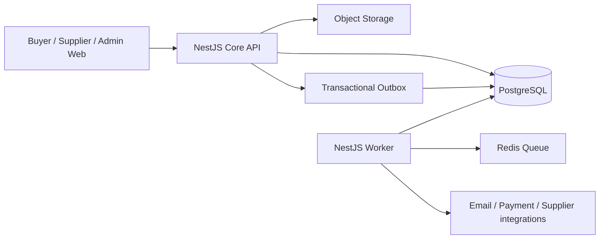

# DentMarket KZ — фундамент backend V2

Статус: рабочий технический документ

Дата аудита: 3 августа 2026

Ветка: `recovery/gate-0`

Базовый коммит аудита: `1b6da4c`

## 1. Решение

Backend **не нужно переписывать с нуля**. Стек и значительная часть доменной логики пригодны для развития. Нужна контролируемая стабилизация существующего модульного монолита:

1. зафиксировать узкое ядро пилота;
2. сделать API-контракт машиночитаемым;
3. отделить HTTP API от фоновых работ;
4. доказать основной путь покупки интеграционными тестами на PostgreSQL;
5. заморозить enterprise-функции до готовности ядра;
6. только после этого унифицировать buyer/supplier/admin UI вокруг стабильного API.

Переписывание сейчас уничтожит уже реализованные транзакции, права доступа, миграции, проверки договоров, compliance, резервы и идемпотентность, но не решит главную продуктовую проблему — отсутствие жёсткого приоритета и критериев готовности.

## 2. Целевое назначение backend

DentMarket — B2B-маркетплейс стоматологических товаров Казахстана. Backend должен обеспечить три основных роли.

### Клиника

- войти в организацию с корректными правами;
- найти товар в едином каталоге;
- сравнить актуальные предложения поставщиков;
- положить предложение в корзину;
- оформить заказ без двойного списания и двойного резерва;
- видеть статус заказов и документов.

### Поставщик

- пройти допуск к маркетплейсу;
- сопоставить свой товар с канонической карточкой;
- опубликовать цену и остаток;
- получить заказ;
- подтвердить доступное количество;
- передать заказ в исполнение.

### Оператор площадки

- управлять организациями и доступами;
- модерировать каталог и поставщиков;
- контролировать договоры и compliance;
- видеть ошибки интеграций и незавершённые операции;
- иметь полный audit trail критичных действий.

## 3. Проверенный снимок текущего backend

Аудит выполнен по коду, Prisma-схеме, тестам и живому локальному API, а не по статусам в старом ТЗ.

| Область                    |                  Фактическое состояние |
| -------------------------- | -------------------------------------: |
| Архитектура                |               NestJS-модульный монолит |
| База                       |                    PostgreSQL + Prisma |
| Доменные модули            |                                     29 |
| Prisma-модели              |                                    148 |
| Prisma-enum                |                                    116 |
| Миграции                   |                                     28 |
| Контроллеры                |                                     41 |
| HTTP operations в OpenAPI  |                                    287 |
| Сервисные файлы            |                                     73 |
| API spec-файлы             |                                     32 |
| Тесты API в текущем suite  | 104, без условно пропущенных DB-тестов |
| Плановые задачи внутри API |                                      6 |
| Пилотный каталог           |                  500 активных карточек |
| Покупаемая часть           |                50 товаров, 500 офферов |
| Пилотные стороны           |              10 клиник, 10 поставщиков |

Живой acceptance-flow прошёл: `health → readiness → каталог → сравнение 10 офферов → корзина → checkout → supplier order → inventory reservation → повтор checkout с тем же idempotency key`.

## 4. Что в текущей реализации уже хорошо

### Стек подходит

- `pnpm` корректно подходит для monorepo и не является риском для production.
- NestJS подходит для большого доменного backend с RBAC, модулями и фоновыми задачами.
- Prisma и PostgreSQL подходят для транзакционной B2B-торговли.
- Next.js подходит для buyer, supplier и admin приложений. Разный UI сейчас — проблема дизайн-системы и организации frontend, а не ограничение Next.js.
- Turbo подходит для сборки нескольких приложений; последовательная production-сборка уже используется для устойчивости по памяти.

Переход на npm, другой backend framework или микросервисы сейчас не даст продуктовой выгоды.

### Доменное ядро не является пустой заготовкой

В `CommerceService` реализованы:

- проверка buyer-организации и доступа оператора;
- проверка активного договора поставщика с маркетплейсом;
- проверка публикации оффера, валюты, цены и количества;
- контроль минимальной партии и шага заказа;
- выбор свежего остатка и FEFO-лота;
- транзакционное создание checkout и заказов по поставщикам;
- резервирование остатка;
- компенсация резервов и перевод checkout в `FAILED` при ошибке;
- идемпотентность checkout;
- outbox- и audit-события.

### Безопасность имеет реальный фундамент

- В development identity может задаваться заголовками для локальной разработки.
- В JWT-режиме входящие identity-заголовки удаляются и формируются из проверенного токена.
- Есть issuer/audience/algorithm constraints и режим обязательного MFA.
- Tenant-доступ проверяется через membership, role и permission.
- Публичные webhook/callback endpoints имеют отдельные механизмы подписи или токена.
- Production-конфигурация запрещает development auth и требует ключевые security-параметры.

### Инфраструктурные паттерны уже присутствуют

- Prisma migrations;
- audit log;
- inbox/idempotency для webhook;
- outbox-события в доменных транзакциях;
- readiness для PostgreSQL, очереди и object storage;
- локальный и production storage drivers;
- структурированные логи.

## 5. Главные технические проблемы

### P0. Нет реальной границы пилота

`DEPLOYMENT_PROFILE=pilot` валидируется, но почти не меняет состав приложения. `AppModule` поднимает все 29 доменных модулей. Вместе с HTTP API запускаются плановые процессы agreements, compliance, integrations, notifications, payment retry и search projection.

Последствия:

- невозможно доказать, что пилот зависит только от согласованного ядра;
- ошибка во второстепенной enterprise-функции может уронить основной API;
- запуск и диагностика сложнее;
- несколько экземпляров API одновременно запускают фоновые циклы;
- партнёр может случайно расширять scope вместо завершения покупки.

Решение: ввести явные `CoreMarketplaceModule`, `OperationsModule`, `EnterpriseModule` и runtime-role `api | worker | all`. На первом этапе не удалять код — отключить необязательные runtime-функции в пилоте и заморозить их развитие.

### P0. OpenAPI не является контрактом frontend/backend

В исходном живом Swagger-документе было обнаружено 287 operations, но:

- `requestBody` описан у 0 operations;
- JSON response schema описана только у одного успешного ответа;
- component schemas отсутствуют.

Этот baseline устранён для основного потока в B0.2: теперь зарегистрирована 21 именованная component schema, 16 core operations имеют проверенные response contracts, четыре изменяющих endpoint имеют request body contracts, а стандартный error envelope проверяется живым запросом. Остальной широкий API по-прежнему переводится на контракты только по мере попадания в согласованный scope.

Zod действительно валидирует многие запросы во время выполнения, но frontend, QA и Codex не могут по OpenAPI узнать форму запроса и ответа. В итоге интеграция строится по чтению контроллеров, ручным типам и догадкам.

Решение:

- сохранить Zod как единый источник правил;
- генерировать из него JSON/OpenAPI schemas либо ввести явные transport DTO;
- не поддерживать две независимые схемы вручную;
- сначала покрыть 12–20 endpoints основного потока, затем остальной API;
- генерировать typed API client для web-приложений;
- проверять breaking changes в CI.

### P0. API одновременно является worker

При отключённом Redis сервисы переходят на inline/database fallback, но cron-задачи продолжают работать в API-процессе. Сейчас это удобно локально, но опасно как production-модель.

Целевая модель:



API и worker могут оставаться двумя entrypoint одного репозитория и одного модульного монолита. Микросервисы пока не нужны.

### P0. До текущего изменения не было воспроизводимого доказательства покупки

Старый `verify:search-commerce` использовал legacy slug и фиксированные UUID старого seed. После перехода на чистый каталог он не доказывал работоспособность.

Добавлен `pnpm verify:pilot-backend`, который:

- собирает API;
- сам запускает его на отдельном порту;
- проверяет readiness;
- динамически находит пилотный товар и офферы;
- проверяет сортировку сравнения;
- создаёт корзину, checkout, заказ и резерв;
- проверяет идемпотентность;
- сверяет итог с PostgreSQL;
- останавливает API после проверки.

Gate намеренно разрешён только для локальной БД, потому что создаёт один демо-заказ при каждом запуске.

### P1. Outbox не имеет единой семантики обработки

Доменные сервисы корректно пишут много типов `OutboxEvent` транзакционно. Но обнаруженный dispatcher явно публикует только `PaymentCaptured`. Notifications отдельно сканируют недавние события и делают idempotent upsert. Для остальных событий статус `PENDING` может остаться навсегда.

Нужно принять одно решение:

1. `OutboxEvent` — очередь доставки: тогда у каждого типа должен быть consumer, retry, dead-letter и финальный статус;
2. это event log: тогда статус публикации не должен вводить в заблуждение;
3. практичный вариант — разделить `DomainEventLog` и `IntegrationOutbox`.

До решения нельзя строить новые интеграции поверх текущего `PENDING` как будто доставка гарантирована.

### P1. Тесты смещены в unit-уровень

104 API-теста проверяют изолированные правила, а обязательный B0.4 gate дополнительно покрывает реальные PostgreSQL-границы:

- параллельное создание активной корзины;
- два одновременных checkout;
- гонка за последним остатком;
- ошибка после DB-транзакции во внешнем резерве;
- повтор webhook;
- повтор worker-задачи;
- tenant isolation.

`pnpm verify:postgres` теперь проверяет checkout concurrency, rollback, idempotency и tenant isolation без Docker. В CI этот же gate выполняется отдельным job на свежем PostgreSQL 17; локально он создаёт собственные fixtures в текущей test-базе и доказывает их полное удаление.

### P1. Seed смешивает базовую платформу и пилот

Активный пилотный каталог содержит ровно 500 карточек, но в физической таблице `Product` после базового seed остаются ещё 5 legacy fixtures. Это не ломает публичный каталог, однако размывает понятие «чистой базы».

Нужно разделить профили:

- `seed:reference` — страны, города, units, permissions;
- `seed:operator` — локальный оператор;
- `seed:pilot` — 10 клиник, 10 поставщиков, 500 карточек, 500 офферов;
- `seed:test` — минимальные фиксированные fixtures для integration tests.

Каждый профиль должен иметь manifest и проверяемые counts.

### P1. Слишком большие сервисы и широкий домен

Примеры размеров:

- imports service — около 1200 строк;
- integration execution — около 1100 строк;
- search service — около 850 строк.

Это не повод массово переписывать их. Декомпозиция выполняется только при работе над конкретным потоком: orchestration отделяется от policy, persistence adapter и provider adapter. Рефакторинг без acceptance-test запрещён.

### P1. Наблюдаемость пока не определяет эксплуатационную готовность

Наличие structured logs, Sentry и OTEL-параметров — фундамент, но не SLO. Для пилота нужны минимум:

- request/correlation ID от HTTP до outbox/worker;
- latency и error rate основных endpoints;
- число `FAILED` checkout;
- возраст старейшего outbox event;
- глубина retry/dead-letter;
- доля stale inventory;
- число заказов без резерва;
- backup/restore runbook и проверка восстановления.

### P2. Нет согласованной политики API lifecycle

Перед подключением внешних клиентов нужно зафиксировать:

- единый error envelope;
- правила pagination/filter/sort;
- date/time и money representation;
- idempotency policy;
- deprecation policy;
- API versioning.

Не следует немедленно механически переносить 287 operations в `/api/v1`. Сначала стабилизируется контракт core endpoints, затем вводится версия без массового бессмысленного churn.

## 6. Целевая граница пилота

### Обязательное ядро

1. Identity, organizations, membership, RBAC.
2. Canonical catalog, categories, search, media.
3. Suppliers, marketplace agreement, offer publication.
4. Price, fresh inventory, inventory reservation.
5. Cart, checkout, supplier order.
6. Minimal documents and notifications.
7. Audit log, integration inbox/outbox, health/readiness.

### Разрешено только как зависимость ядра

- минимальный compliance, реально блокирующий публикацию или покупку;
- минимальный logistics status;
- mock payment только для демонстрации сценария;
- imports только для загрузки пилотных данных.

### Заморозить до доказанного пилота

- AI-функции;
- сложный billing;
- promotions;
- расширенные trust/reputation механики;
- сложные approval chains;
- широкий набор внешних коннекторов;
- enterprise support automation;
- внешние платежи и EDS до отдельной интеграционной готовности.

«Заморозить» означает не удалять, а не добавлять функции и не связывать с ними основной checkout без отдельного решения.

## 7. Backend Definition of Done

Задача backend считается готовой, только если одновременно выполнено следующее:

- описан один пользовательский сценарий и его non-goals;
- есть Zod/DTO request schema;
- есть явная response schema;
- endpoint отражён в OpenAPI;
- tenant и permission checks проверены тестом;
- критичная запись выполняется транзакционно;
- повтор запроса безопасен там, где возможен retry;
- создаются необходимые audit/outbox события;
- ошибки имеют стабильные machine-readable codes;
- unit tests проходят;
- integration test на PostgreSQL проходит;
- основной acceptance-gate не регрессировал;
- миграция имеет путь deploy и rollback/forward-fix;
- документация обновлена в том же коммите.

Наличие контроллера или UI-кнопки не означает готовность функции.

## 8. План реализации

### B0 — стабилизация фундамента

Цель: сделать текущее ядро измеримым и безопасным для дальнейшей работы.

| Готово | ID   | Задача                       | Результат                                                       | Gate                        |
| ------ | ---- | ---------------------------- | --------------------------------------------------------------- | --------------------------- |
| [x]    | B0.1 | Живой pilot backend flow     | Динамический тест покупки                                       | `pnpm verify:pilot-backend` |
| [x]    | B0.2 | Core API contract            | Полные schemas для catalog/compare/cart/checkout/orders         | `pnpm verify:core-contract` |
| [x]    | B0.3 | Runtime split                | API не запускает worker jobs; worker имеет отдельный entrypoint | `pnpm verify:runtime-split` |
| [x]    | B0.4 | PostgreSQL integration suite | Concurrency, rollback, idempotency, tenant isolation            | `pnpm verify:postgres`      |
| [x]    | B0.5 | Seed profiles                | reference/operator/pilot/test разделены                         | `pnpm verify:seed-profiles` |
| [x]    | B0.6 | Outbox ADR                   | Однозначные delivery/status/retry правила                       | `pnpm verify:outbox`        |

Выполнено в B0.2:

- [x] Shared Zod response schemas для health, catalog, comparison, cart, checkout и supplier orders.
- [x] Отдельные типы сырого HTTP request и нормализованного service input.
- [x] OpenAPI 3.1 components и `$ref` для 16 операций основного потока.
- [x] Request body, query, path parameter, bearer auth и error schemas.
- [x] Единый безопасный error envelope с `code`, `requestId`, `path` и `details`.
- [x] Типизированные методы core-flow в общем `@marketplace/api-client`.
- [x] Contract-only gate без создания заказа.
- [x] Runtime-валидация реальных response payloads shared-схемами.
- [x] Проверка contract gate в GitHub CI.
- [x] Полный purchase gate после изменения контрактов.

Выполнено в B0.3:

- [x] Явные роли процесса `api | worker | all` и единый capability contract.
- [x] API запускает HTTP и BullMQ producer без cron и queue consumer.
- [x] Worker имеет отдельный `start:worker`, запускает cron и BullMQ consumer без HTTP.
- [x] Роль `all` разрешена только в development/test и используется `dev:local`.
- [x] Readiness проверяет зависимости и queue capability текущей роли.
- [x] Local и production Compose запускают API и worker раздельно.
- [x] Process-level gate проверяет capability matrix, entrypoint guards и production-запрет `all`.
- [x] Gate добавлен в GitHub CI.

Выполнено в B0.4:

- [x] Реальный HTTP/NestJS/Prisma gate на PostgreSQL вместо искусственной таблицы Testcontainers.
- [x] Проверка tenant isolation между двумя клиниками через защищённые cart endpoints.
- [x] Принудительная ошибка внутри checkout-транзакции и доказательство полного rollback.
- [x] Два конкурентных checkout-запроса с одним idempotency key создают один checkout, заказ и резерв.
- [x] Две клиники конкурируют за остаток 5 единиц: один checkout завершается, второй получает контролируемый конфликт (с компенсацией, если checkout уже был создан), остаток неотрицательный.
- [x] Временные товары, офферы, клиники, корзины и SQL trigger удаляются с zero-residue assertion.
- [x] Docker/Testcontainers не требуются для локального запуска.
- [x] Отдельный обязательный `postgres-integration` job запускает gate на свежем PostgreSQL 17 в GitHub CI.

Выполнено в B0.5:

- [x] Отдельные idempotent-команды `db:seed:reference`, `db:seed:operator`, `db:seed:test` и `db:seed:pilot`.
- [x] Reference profile создаёт словари, единицы, права, feature flags и шаблон договора; operator profile создаёт единственного локального оператора с membership.
- [x] Test profile добавляет только минимальную детерминированную тестовую клинику; `verify:postgres` использует именно его вместо смешанного legacy seed.
- [x] CI содержит отдельную проверку на чистой PostgreSQL базе: test profile не должен создавать pilot organizations или offers до синхронизации каталога.
- [x] Pilot profile проверяет 10 клиник, 10 поставщиков, 500 offers и 50 позиций с десятью сравниваемыми offers.
- [x] Повторный pilot seed обновляет свои записи через upsert и не удаляет offers, на которые уже ссылаются carts или orders.
- [x] `pnpm verify:seed-profiles` добавлен в CI после синхронизации каталога.

Выполнено в B0.6:

- [x] ADR 005 фиксирует at-least-once delivery, статусы, claim lease, retry,
      dead-letter и требования идемпотентности.
- [x] Все события обрабатываются единым dispatcher, а не остаются бессрочно
      `PENDING` вне `PaymentCaptured`.
- [x] Conditional claim защищает от двух одновременных worker; просроченный
      `PROCESSING` lease восстанавливается.
- [x] Retry использует exponential backoff до одного часа; постоянная ошибка
      или исчерпание `maxAttempts` переводит событие в `DEAD_LETTER`.
- [x] Проекция уведомлений и `PaymentCaptured -> ORDER_EXPORT` зарегистрированы
      как идемпотентные handlers.
- [x] Миграция `20260818130000_outbox_delivery_semantics` применена как 29-я;
      dispatcher tests, PostgreSQL regression и runtime split прошли.

Текущий статус: **B0.1–B0.6, B1.1–B1.2, B2.1–B2.3, B3.1–B3.3,
B4.1–B4.2 и B4.5 реализованы и проходят**.
High source-code backlog B4.5-R1 закрыт фазами R1A и R1B. B4.5-R2A и R2B
закрыли organization enumeration/capability disclosure и XLSX decompression
exhaustion; следующая задача: **B4.5-R2C — delayed session revocation**. R2
остаётся выше B4.3, пока два оставшихся Medium findings не исправлены и не
прошли source-to-sink revalidation.

### B1 — покупка клиникой

| Готово | ID   | Задача                            | Gate                   |
| ------ | ---- | --------------------------------- | ---------------------- |
| [x]    | B1.1 | Актуализация корзины              | `pnpm verify:postgres` |
| [x]    | B1.2 | Flow A: поиск → сохранённый заказ | `pnpm verify:flow-a`   |

B1.2 должен зафиксировать один безусловно рабочий путь:

1. поиск;
2. карточка;
3. сравнение;
4. корзина;
5. checkout;
6. заказ;
7. видимый статус.

Gate: одна клиника оформляет заказы у одного и нескольких поставщиков; повтор и конкурентный запрос не создают дублей и не делают остаток отрицательным.

Выполнено в B1.2:

- [x] Временная клиника с минимальными buyer permissions входит через
      development identity и полностью удаляется после gate.
- [x] Buyer находит реальный pilot product и открывает сравнение 10 офферов:
      8 доступны к заказу, 2 честно показаны недоступными.
- [x] Отдельные browser-сценарии создают заказ одному поставщику и split-order
      двум поставщикам.
- [x] После checkout Buyer видит номера заказов и статус
      «Ждёт подтверждения».
- [x] Два параллельных повтора с тем же idempotency key возвращают исходный
      checkout и не создают дублей.
- [x] Прямой PostgreSQL assertion проверяет один checkout, ожидаемое число
      supplier orders и активных резервов, а также неотрицательный остаток.
- [x] Zero-residue assertion после теста: временные организации, пользователи,
      корзины, compliance-checks и связанные outbox events отсутствуют.
- [x] Pilot seed гарантирует 500 действующих `PASSED/ALLOWED/GREEN`
      compliance-checks для 500 demo-офферов; это проверяет
      `pnpm verify:seed-profiles`.

### B2 — исполнение поставщиком

| Готово | ID   | Задача                                             | Gate                    |
| ------ | ---- | -------------------------------------------------- | ----------------------- |
| [x]    | B2.1 | Полное/частичное подтверждение supplier order      | `pnpm verify:flow-b2`   |
| [x]    | B2.2 | Статус отгрузки, уведомление клиники и audit trail | `pnpm verify:flow-b2`   |
| [x]    | B2.3 | Минимальные документы заказа и отгрузки            | PostgreSQL + Playwright |

1. список новых заказов;
2. подтверждение полного или частичного количества;
3. корректировка резерва;
4. смена статуса;
5. уведомление клиники;
6. audit trail.

Выполнено в B2.1:

- [x] Поставщик открывает реальный новый заказ и подтверждает всё заказанное
      количество через production-сборку supplier-web.
- [x] Частичное подтверждение требует buyer-visible причину по каждой
      уменьшенной позиции и сохраняет её в `SupplierOrderItem.decisionReason`.
- [x] Статус полного, частичного и нулевого подтверждения вычисляется единым
      доменным правилом как `CONFIRMED`, `PARTIALLY_CONFIRMED` или `REJECTED`.
- [x] Уменьшение количества атомарно пересчитывает item/order/checkout totals,
      уменьшает локальный резерв и возвращает разницу в balance и lot.
- [x] Serializable transaction, row lock и retry `P2034` защищают повтор и
      конкуренцию; одинаковое решение идемпотентно, другое решение конфликтует.
- [x] Tenant isolation проверена: актор другого поставщика получает `403`.
- [x] Buyer видит принятые количества, причину изменения и новый итог заказа.
- [x] `supplier_order.confirmed` audit и `SupplierOrderConfirmed` outbox event
      фиксируются один раз; event содержит обе организации и данные решения.
- [x] `pnpm verify:flow-b2` проходит 2/2, а общий `pnpm verify:web` — 12/12 с
      zero-residue очисткой временных заказов, акторов и резервов.
- [x] Supplier production CSP использует request-scoped nonce; Playwright
      выполняется с `bypassCSP=false` и доказывает работу React hydration.

Ограничение B2.1: частичное освобождение внешнего резерва намеренно получает
контролируемый конфликт до отдельной orchestration-задачи интеграционного
коннектора.

Выполнено в B2.2:

- [x] Общие Zod-схемы, OpenAPI и `@marketplace/api-client` описывают создание,
      чтение и versioned transition отгрузки; buyer/supplier order responses
      возвращают склад, позиции и текущие отгрузки.
- [x] Поставщик через production-сборку supplier-web создаёт отгрузку только
      для оплаченного подтверждённого заказа и проходит ручной путь
      `DRAFT → PLANNED → PACKING → READY → DISPATCHED`.
- [x] Каждый переход атомарно обновляет shipment и supplier order, записывает
      `shipment.status_changed` audit и `ShipmentStatusChanged` outbox event.
- [x] Event содержит buyer/supplier tenant, номера заказа и отгрузки, старый и
      новый статус, перевозчика и tracking; transactional outbox создаёт
      идемпотентное in-app уведомление клиники.
- [x] Buyer через production-сборку видит статус, склад, перевозчика и tracking
      внутри заказа, а затем видит отдельное уведомление с теми же данными.
- [x] Tenant isolation возвращает `403` чужому поставщику, а stale version
      возвращает `409` без второго перехода или лишнего audit/outbox evidence.
- [x] После B2.3 `pnpm verify:flow-b2` проходит 4/4, `pnpm verify:web` — 14/14; сценарий
      включает viewport 390 px, проверку отсутствия page overflow и zero-residue
      очистку shipment/notification/audit/outbox fixtures.

Ограничение B2.2: payment settlement является начальным условием сценария и
не подменяется shipment-логикой. Закрытие доставки и proof of delivery
остаются отдельными задачами; document pack закрыт в B2.3 ниже, а внешний
email-провайдер остаётся отдельным production-readiness gate.

Выполнено в B2.3:

- [x] Общие Zod-схемы, OpenAPI и `@marketplace/api-client` описывают
      `POST /supplier-orders/:orderId/document-pack` и три документа ответа:
      спецификацию, счёт и накладную.
- [x] Комплект формируется только поставщиком заказа или оператором для
      оплаченного заказа и уже отправленной отгрузки с адресом доставки; чужой
      supplier tenant получает `403`, неверное состояние — `409`.
- [x] Денежные значения и состав документов строятся сервером из persisted
      order/shipment snapshot в PostgreSQL, без доверия произвольным данным UI;
      деньги форматируются без JavaScript `number`.
- [x] Reference seed детерминированно создаёт четыре шаблона, включая
      `ORDER_SPECIFICATION_RU`, `INVOICE_RU` и `WAYBILL_RU`; все seed profiles
      проходят с 10 клиниками, 10 поставщиками и 500 pilot offers.
- [x] Повторное формирование идемпотентно возвращает те же три `Document` и не
      создаёт дополнительные `document.generated` audit или `DocumentGenerated`
      outbox events.
- [x] Supplier и Buyer видят один и тот же комплект внутри заказа, скачивают
      PDF/DOCX с checksum evidence; интерфейс имеет empty/error/success/busy
      состояния и проходит viewport 390 px без page overflow.
- [x] `pnpm verify:flow-b2` проходит 4/4, `pnpm verify:web` — 14/14; PostgreSQL
      проверяет связи checkout/order/shipment, immutable snapshot, checksum,
      audit/outbox, tenant isolation и zero-residue очистку файлов и записей.
- [x] `pnpm typecheck`, `pnpm test`, `pnpm verify:core-contract`,
      `pnpm verify:postgres` и `pnpm verify:seed-profiles` проходят.

Ограничение B2.3: квалифицированная ЭЦП, внешний email, налоговый ЭСФ,
production object storage и proof of delivery остаются отдельными
production/legal gates и не имитируются локальным комплектом.

### B3 — catalog operations

| Готово | ID   | Задача                                           | Gate                    |
| ------ | ---- | ------------------------------------------------ | ----------------------- |
| [x]    | B3.1 | CSV staging → validation → matching              | integration test        |
| [x]    | B3.2 | Operator review → publication → Buyer visibility | PostgreSQL + Playwright |
| [x]    | B3.3 | Откат ошибочного batch без потери raw/evidence   | PostgreSQL + Playwright |

1. импорт поставщика в staging;
2. validation report;
3. сопоставление с каноническим товаром;
4. operator review спорных позиций;
5. публикация оффера;
6. откат ошибочного batch.

Выполнено в B3.1:

- [x] Общие Zod response/status-контракты импорта используются типизированным
      API client; request/response/error-границы операции зарегистрированы в OpenAPI.
- [x] Реальный UTF-8 CSV проходит upload policy, quarantine и parser;
      `ImportBatch.checksum` фиксирует исходные байты файла, а raw-строки
      сохраняются до обработки без потери доказательств.
- [x] Точное совпадение создаёт подтверждённый mapping и только `DRAFT` offer;
      неизвестный SKU переходит в `MATCH_PENDING` с `ProductCandidate(PENDING)`,
      некорректные обязательные поля и цена — в `REJECTED` с явными кодами причин.
- [x] Цена `9007199254740993` minor units и количество записываются без
      преобразования через JavaScript `number`, поэтому точность Prisma Decimal
      не теряется.
- [x] Завершённый batch возвращает сохранённый результат идемпотентно;
      атомарный claim `MAPPED → PROCESSING` защищает от конкурентной повторной
      обработки, чужая организация получает `403`.
- [x] Повторная обработка не создаёт дубли external items, mapping memory,
      offers, price history, audit или outbox; автоматическая публикация отсутствует.
- [x] `pnpm verify:flow-b3` проходит 3/3, детерминированные повторы B3.2 и
      B3.3 — 10/10 каждый, `pnpm verify:web` — 17/17; PostgreSQL-проверки подтверждают checksum,
      статусы, связи, audit/outbox, tenant isolation и zero-residue cleanup.
- [x] `pnpm typecheck`, `pnpm test`, `pnpm verify:core-contract`,
      `pnpm verify:postgres`, `pnpm verify:runtime-split`, `pnpm verify:outbox`,
      `pnpm verify:pilot-backend`, `pnpm build` и DB-backed
      `pnpm verify:security-storage` проходят.

Ограничение B3.1: UI загрузки, operator review, публикация, Buyer visibility и
rollback не входили в эту фазу. Operator review/publication закрыты B3.2,
а compensating rollback — B3.3.

Выполнено в B3.2:

- [x] Общие Zod-контракты описывают очередь import review, решение оператора и
      versioned publication response; OpenAPI и типизированный API client обновлены
      вместе с сервером.
- [x] Только marketplace operator может читать очередь импорта и одобрять
      `ProductCandidate`; permission-bearing supplier получает `403`.
- [x] Одобрение атомарно создаёт `ACTIVE` product/variant, sale packaging,
      `DRAFT` offer/publication, точную KZT-цену, свежий остаток, confirmed match и
      mapping memory; исходные raw/normalized данные остаются связаны с batch.
- [x] До явной публикации Buyer не видит новую карточку. Publication gate
      повторно проверяет активного поставщика, product/variant, упаковку, свежую
      положительную KZT-цену, остаток, действующий договор и compliance.
- [x] State-changing publish использует `expectedVersion`; stale request
      получает `409`, повтор уже достигнутого состояния идемпотентен и не создаёт
      второй audit/outbox. Успешная публикация активирует offer, переводит import row
      в `PUBLISHED` и синхронно перестраивает Buyer search projection.
- [x] Admin получил отдельную Fluent UI v9 очередь с loading/empty/error/success,
      видимыми labels и confirmation dialog. Production CSP использует per-request
      nonce, а 390 px browser gate подтверждает отсутствие page overflow.
- [x] `pnpm verify:flow-b3` проходит 3/3, B3.2 repeat — 10/10,
      `pnpm verify:web` — 17/17; `pnpm typecheck`, `pnpm test`, `pnpm build`,
      `pnpm verify:core-contract`, `pnpm verify:postgres`,
      `pnpm verify:runtime-split`, `pnpm verify:outbox`,
      `pnpm verify:pilot-backend` и DB-backed `pnpm verify:security-storage` проходят.

Ограничение B3.2: текущий действующий marketplace agreement сохранён как
технический gate до отдельного legal review Product V2. XLSX/PDF import и
production connectors не входят в фазу; compensating rollback закрыт B3.3.

Выполнено в B3.3:

- [x] Миграция `20260819133000_import_batch_rollback` добавляет состояния
      `ROLLING_BACK/ROLLED_BACK`, rollback metadata и отдельный статус строк без
      физического удаления `ImportBatch` или `ImportRow`.
- [x] Общий Zod-контракт, OpenAPI и типизированный API client описывают reason,
      optimistic `expectedUpdatedAt`, сохранённые evidence и счётчики компенсации.
- [x] Serializable transaction атомарно переводит завершённый batch через
      conditional claim, скрывает и архивирует созданные им offers, деактивирует
      актуальные цены, обнуляет доступный остаток, отзывает mapping, архивирует
      созданные product/variant и синхронно перестраивает search projection.
- [x] Автоматический rollback получает `409`, если request устарел, offer
      существовал до batch, effect был superseded, либо появились order items или
      активные reservations; tenant isolation возвращает `403` без частичного effect.
- [x] Checksum, quarantined upload, raw/normalized rows, прежние validation errors,
      price history и связи сохраняются. `rollbackEvidence` фиксирует before-snapshot
      строк, compliance, offers/publication, prices, inventory, mappings и products.
- [x] Повтор уже завершённого rollback возвращает тот же response, повторно
      доводит search projection до консистентного состояния и не создаёт второй
      `import.batch.rolled_back` audit или `ImportBatchRolledBack` outbox event.
- [x] `pnpm verify:flow-b3` проходит 3/3, B3.3 repeat — 10/10,
      `pnpm verify:web` — 17/17; отдельный Flow B2 regression — 4/4.
- [x] `pnpm typecheck`, `pnpm test`, `pnpm build`, `pnpm verify:core-contract`,
      `pnpm verify:postgres`, `pnpm verify:runtime-split`, `pnpm verify:outbox`,
      `pnpm verify:pilot-backend` и DB-backed `pnpm verify:security-storage` проходят.

Ограничение B3.3: автоматическая компенсация намеренно не изменяет offer,
который существовал до batch, и не откатывает данные, уже использованные заказом
или активной резервацией. Такие случаи получают `409` и требуют отдельного
операторского remediation workflow. Его observability закрыт в B4.1, а
восстановимость данных — в B4.2.

### B4 — эксплуатационный минимум

- [x] B4.1 — metrics и alerts;
- [x] B4.2 — backup/restore rehearsal;
- [ ] B4.3 — dead-letter operations и защищённый replay;
- [ ] B4.4 — rate limiting и production auth runbook;
- [x] B4.5 — security/dependency scan;
- [ ] B4.6 — нагрузочный профиль каталога и checkout.

Выполнено в B4.1:

- [x] Защищённый отдельным `METRICS_BEARER_TOKEN` endpoint `GET /api/metrics`
      отдаёт Prometheus text exposition; production без независимого token не
      стартует.
- [x] HTTP histogram использует только low-cardinality labels `method`, Express
      route template и `status_code`; tenant/user/UUID/query в labels не попадают.
- [x] PostgreSQL gauges покрывают checkout statuses, import statuses и rollback
      age/audit count, а также все метрики ADR 005: outbox depth, oldest age,
      expired lease, attempts и errors по `eventType`.
- [x] Семь versioned alert rules фиксируют PromQL, severity, owner, `for`, порог
      и runbook для API/checkout, outbox и import rollback; 14 synthetic vectors
      машинно проверяют healthy/firing границы.
- [x] OTLP exporter одинаково принимает collector base URL и готовый
      `/v1/traces`, не формируя ошибочный двойной путь.
- [x] `pnpm verify:observability` подтверждает 4/4 unit, alert catalog,
      `401/200` metrics auth и реальные PostgreSQL gauges; `pnpm typecheck`,
      `pnpm test` (API 117/117), `pnpm build`, `pnpm verify:runtime-split`,
      `pnpm verify:production-config`, `pnpm verify:outbox`,
      `pnpm verify:core-contract`, `pnpm verify:postgres` и
      `pnpm verify:pilot-backend` проходят.
- [x] `pnpm verify:observability` включён в основной PostgreSQL-backed CI job
      после production build.

Ограничение B4.1: локальный contract и synthetic thresholds доказаны, но
внешняя доставка alert и production dashboard получают `LIVE_VERIFIED` только
при deployment monitoring stack.

Выполнено в B4.2:

- [x] `pnpm verify:backup-restore` создаёт custom-format PostgreSQL dump,
      manifest и SHA-256, затем восстанавливает их только в автоматически созданную
      БД `dentmarket_restore_drill_*`; source и target сравниваются до restore.
- [x] Target должен быть новым, помечается уникальным database comment и
      удаляется только после повторной проверки marker; прикладному пользователю
      `marketplace` право `CREATEDB` не выдавалось.
- [x] Source сверяется до и после dump. Все 149 public tables и sequences
      сравниваются по row count, а все таблицы ниже safety-порога — также по
      content hash; изменение source во время backup делает gate красным.
- [x] Object-storage ветка проверена двумя детерминированными файлами разных
      типов; backup и restore inventory совпали по path, bytes и SHA-256.
- [x] Restored DB имеет 31 актуальную Prisma migration, запускает API и отдаёт
      успешные liveness/readiness. Финальный локальный замер: backup 0,887 с,
      restore 5,362 с, полный drill 23,364 с; после gate осталось 0 drill-баз.
- [x] Gate добавлен в PostgreSQL CI job с PostgreSQL 17 client через
      изолированный Docker mode; production legacy verifier больше не выполняет
      `DROP SCHEMA`, требует отдельную пустую БД и точное подтверждение её имени.
- [x] `pnpm typecheck`, `pnpm test` (API 117/117), `pnpm build`,
      `pnpm verify:postgres`, `pnpm verify:production-config`, shell syntax,
      formatting и `git diff --check` проходят.

Ограничение B4.2: локальный logical dump/restore получает
`INTEGRATION_VERIFIED`, но не доказывает managed WAL/PITR, S3 versioning,
retention и restore реального production snapshot. Эти пункты остаются
deployment evidence; политика сохраняет RPO 15 минут и RTO 4 часа.

Выполнено в B4.5:

- [x] Standard repository scan `7a5358c7-a6f3-459d-a1fa-8bc22ef5c822`
      завершён на revision `e24913c9f50643ee602686bc6432a35bfc03473a` и зафиксировал
      5 high и 4 medium findings. Coverage остаётся partial только для live
      infrastructure и одного deferred I/O receipt; критичные source paths были
      покрыты независимым baseline и root review.
- [x] Production dependency audit изменён с 15 high и 6 moderate на
      `No known vulnerabilities found`: Next 16.2.11, Sharp 0.35.3,
      PostCSS 8.5.26, pdfjs-dist 6.2.108 и узкие pnpm overrides для уязвимых
      transitive ranges.
- [x] `pnpm typecheck` проходит 12/12, `pnpm test` — API 117/117, schemas
      38/38, api-client 7/7, Buyer 5/5 и Supplier 1/1; PDF import/render regression
      проходит на pdfjs-dist 6.2.108.
- [x] `pnpm build` проходит 8/8: API, Prisma client и четыре Next-приложения
      собраны на обновлённом dependency graph.
- [x] `pnpm verify:production-config`, DB-backed
      `pnpm verify:security-storage`, `pnpm verify:security`,
      `pnpm verify:postgres`, `pnpm verify:runtime-split` и
      `pnpm verify:core-contract` проходят.
- [x] `pnpm verify:web` проходит 17/17. Default suite переведён на один worker,
      потому что shared PostgreSQL/API fixtures и ограниченная память делали
      четырёхworkerный запуск недетерминированным; assertions и сценарии не
      ослаблены.
- [x] Долговечный отчёт и remediation backlog находятся в
      `../governance/SECURITY_AUDIT_B4_5_2026-08-19.md`; derived hardening portfolio
      отдельно описывает центральные platform-authority и outbound-egress controls.
- [x] B4.5-R1A закрывает три authorization High findings: tenant role
      non-escalation и legacy grant filtering, operator-only canonical catalog,
      capability-bound AI roles. Оба invitation acceptance path выполняют
      accept-time role ownership revalidation до транзакции.
- [x] Финальный security diff-scan `5d31ee89-1cc1-43dd-a3f6-70b1789ee0a2`
      проверил 17/17 changed source items с complete coverage и `0 findings`;
      `pnpm verify:platform-authority` доказал direct/legacy/invitation,
      catalog child mutation и AI legacy-conversation сценарии на PostgreSQL/API.
- [x] После R1A повторно проходят dependency audit, typecheck 12/12,
      API 124/124 и остальные workspace tests, build 8/8, production/security
      config и storage, PostgreSQL, runtime split, core contract и browser 17/17.
- [x] B4.5-R1B добавляет единый `OutboundRequestGateway`: HTTPS/443 policy,
      проверку всех A/AAAA и public IP ranges, DNS pinning, same-origin redirect
      revalidation, общий deadline, response-size limit и безопасные ошибки.
- [x] `CUSTOM_API` больше не выполняет прямой `fetch`, а private/loopback,
      mixed-DNS и alternative-IP destinations отклоняются до чтения ответа;
      `MOYSKLAD` закреплён за `api.moysklad.ru` и игнорирует tenant base URL.
- [x] `pnpm verify:outbound-security` проходит 25/25 targeted tests и статический
      bypass gate; финальный diff-scan `657c3363-632e-42c0-8d08-f09880a55745`
      проверил 9/9 source items с complete coverage и `0 findings`.
- [x] После R1B повторно проходят frozen install, dependency audit, typecheck
      12/12, API 136/136 и остальные workspace tests, build 8/8,
      production config, DB-backed security storage, live security, PostgreSQL,
      runtime split, core contract, platform authority и browser 17/17.

- [x] B4.5-R2A закрывает organization enumeration/capability disclosure: `GET
      /organizations` передаёт actor/tenant context в `OrganizationsService`,
      а `PlatformAuthorityPolicy` разрешает unscoped capability projection только
      активному marketplace operator.
- [x] Supplier/buyer с обычным `organization.view` получает `403` до Prisma
      `findMany`; operator сохраняет полный список для workbench. Unit regression
      и PostgreSQL/API scenario `tenant_denied_operator_allowed` покрывают оба
      исхода.
- [x] После R2A проходят `pnpm typecheck` (12/12), `pnpm test` (API 138/138,
      schemas 38/38, api-client 7/7, Buyer 5/5, Supplier 1/1), `pnpm build` (8/8),
      dependency audit, production config, DB-backed security storage, live
      security, `pnpm verify:postgres`, `pnpm verify:runtime-split`,
      `pnpm verify:core-contract`, `pnpm verify:platform-authority`,
      `pnpm verify:web` (17/17) и `git diff --check`.

- [x] B4.5-R2B ограничивает XLSX ZIP central directory до передачи архива в
      ExcelJS: не более 2 000 записей, 16 MiB на запись, 64 MiB суммарно и
      compression ratio 200; ZIP64 sentinel и неконсистентные metadata
      отклоняются.
- [x] Добавлены parser и ZIP policy regressions для обычного файла, per-entry /
      total limits, zip-bomb ratio и ZIP64; malicious metadata отклоняется до
      вызова ExcelJS.
- [x] После R2B проходят `pnpm typecheck` (12/12), `pnpm test` (API 143/143,
      schemas 38/38, api-client 7/7, Buyer 5/5, Supplier 1/1), `pnpm build`
      (8/8), dependency audit, production config, DB-backed security storage,
      live security, PostgreSQL, runtime split, core contract,
      `pnpm verify:platform-authority`, `pnpm verify:outbound-security`,
      `pnpm verify:web` (17/17) и `git diff --check`.

Ограничение B4.5: dependency finding и все четыре High source findings, а также
organization enumeration и XLSX Medium findings закрыты. Приложение ещё не
production-safe: открыты 2 Medium — delayed session revocation и notification
SSRF. Их чекбоксы остаются `[ ]` до исходного source-to-sink revalidation после
исправления.

Следующий этап — **B4.5-R2C**, а не B4.3: сначала закрывается delayed session
revocation, затем notification SSRF отдельными change sets. После всего R2 и
повторного security regression можно возвращаться к защищённому dead-letter
replay.

### B5 — frontend unification

Начинать после B0.2 и стабильного B1. Общая дизайн-система должна использовать общий типизированный API client, общие состояния loading/error/empty и одинаковую терминологию. Marketplace, кабинет клиники, поставщика и оператора сохраняют разные задачи, но не разные визуальные языки.

- [ ] B5.1 — Buyer V2 routes и feature-компоненты поверх подтверждённого B1.
- [ ] B5.2 — Supplier journey без монолитного route-файла.
- [ ] B5.3 — Operator P0/P1 work queue и единый visual language.

## 9. Как ставить задачи Codex партнёру

Каждая задача должна помещаться в один пользовательский путь.

Шаблон:

```text
Цель: что конкретно сможет сделать пользователь.
Роль: клиника / поставщик / оператор.
Начальное состояние: какие данные уже есть.
Основной сценарий: 3–7 шагов.
Бизнес-правила: конкретные ограничения.
Non-goals: что в эту задачу не входит.
API-контракт: request, response, error codes.
Данные: какие таблицы и миграции допустимы.
Проверка: unit + PostgreSQL integration + acceptance command.
Definition of Done: наблюдаемый итог, а не список файлов.
```

Плохая задача: «сделай систему заказов».

Хорошая задача: «клиника добавляет один опубликованный оффер со свежим остатком в активную корзину; повторное добавление обновляет количество; чужая организация получает 403; добавить request/response schemas и PostgreSQL integration test; платежи и доставка не входят».

## 10. Обязательный workflow разработки

1. Взять один ID из очереди B0–B4.
2. Сначала написать/уточнить acceptance scenario.
3. Зафиксировать API contract.
4. Реализовать минимальное изменение.
5. Выполнить migration и seed только при необходимости.
6. Запустить targeted tests.
7. Запустить `pnpm typecheck`.
8. Запустить `pnpm test`.
9. Запустить `pnpm verify:pilot-backend` для изменений ядра.
10. Перед merge запустить `pnpm build`.
11. В одном коммите обновить документацию и verification evidence.

Нельзя одновременно брать новую backend-функцию, редизайн трёх кабинетов и новую интеграцию. Это разные задачи и разные acceptance gates.

## 11. Зафиксированный результат B0.6

Реализован **B0.6 Transactional Outbox**:

- [x] Статусы `PENDING → PROCESSING → PUBLISHED/FAILED/DEAD_LETTER` однозначны.
- [x] Conditional claim и lease recovery покрыты тестами.
- [x] Retry/backoff, permanent error и max-attempt DLQ покрыты тестами.
- [x] Notifications и payment order export подключены через handler registry.
- [x] ADR, migration, CI gate и эксплуатационные правила обновлены вместе с кодом.

B1.2, B2.1–B2.3, B3.1–B3.3 и B4.1–B4.2 после этого этапа также закрыты.
Текущая следующая задача зафиксирована в разделе 8:
**B4.5 — security/dependency scan**.

## 12. Команды локальной проверки

```powershell
pnpm db:prepare-pilot
pnpm typecheck
pnpm test
pnpm verify:runtime-split
pnpm verify:outbox
pnpm verify:observability
pnpm verify:backup-restore
pnpm verify:postgres
pnpm verify:core-contract
pnpm verify:pilot-backend
pnpm build
```

Для повседневного запуска:

```powershell
pnpm dev:local
```

`verify:pilot-backend` создаёт тестовый заказ и предназначен для локальной пилотной БД. Для удалённой БД команда по умолчанию заблокирована.

### Выполнено в B1.1 — актуализация корзины

- [x] Сохранять подтверждённый снимок цены и доступного остатка при добавлении товара.
- [x] Возвращать по каждой позиции старую и новую цену, сумму и остаток через `POST /carts/:cartId/validate`.
- [x] Показывать изменения и недоступность позиции в корзине клиники.
- [x] Требовать принятия новой цены до checkout.
- [x] Не резервировать товар на время хранения в корзине; повторно проверять и резервировать его только при checkout.
- [x] Проверять сценарий на живой PostgreSQL: изменение цены и остатка → diff → `409 CART_REVALIDATION_REQUIRED` → принятие → checkout.

## 13. Итоговая оценка

Текущий backend сложнее, чем нужно пилоту, но не является бесполезным или фиктивным. Его сильная часть — доменные правила, PostgreSQL-модель, транзакции, tenant/RBAC и защитные паттерны. Его слабая часть — управление границами, контракт API, integration evidence и эксплуатационная ясность.

Правильная стратегия: **не переписывать, а вырезать понятное ядро внутри текущего modular monolith, поставить вокруг него жёсткие gates и не развивать остальной scope до завершения базовой покупки**.
