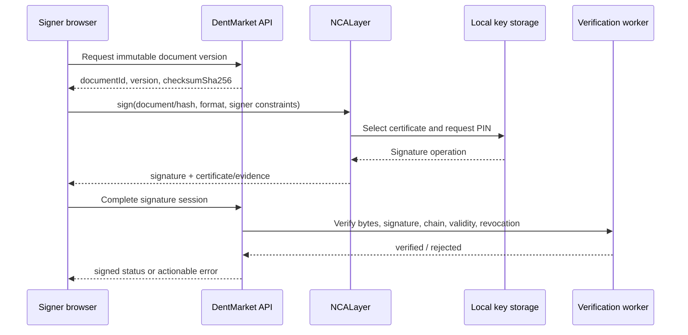
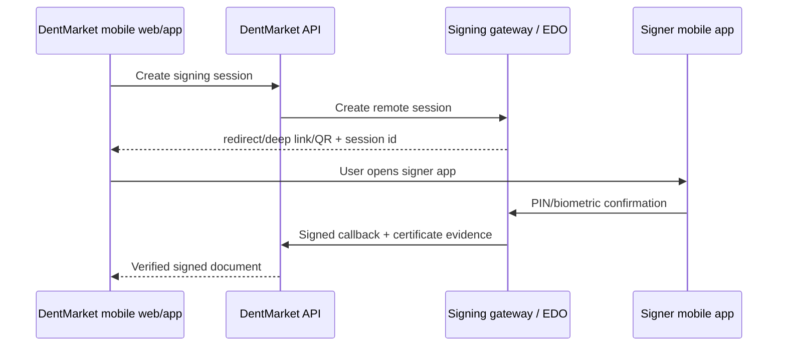
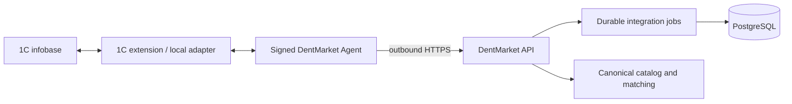

# ЭЦП НУЦ РК и 1С — техническая спецификация интеграций

**Статус:** draft target architecture; production readiness не подтверждает
**Дата:** 21 августа 2026
**Область:** DentMarket KZ, supplier integrations, documents, catalog matching
**Владелец:** Engineering / Integrations

## Implementation checkpoint — 2 сентября 2026

В репозитории реализован и проверен только foundation-слой интеграций:

- desktop-подписание формирует detached CMS через NCALayer и передаёт контейнер на server-side verification boundary;
- callback удалённого шлюза защищён HMAC, timestamp window и replay/idempotency control;
- BIN сертификата обязан совпадать с организацией подписанта, а checksum — с неизменяемой версией документа;
- mobile/remote flow требует `signingUrl` и не имеет скрытого fallback в desktop NCALayer;
- 1С Agent использует исходящий HTTPS, typed job contracts, локальную validation результата адаптера, retry classification и redaction ошибок;
- supplier UI показывает recoverable состояния NCALayer и использует общие DentMarket controls.

Это не означает production readiness. До статуса `LIVE` отсутствуют: выбранный и аттестованный внешний verification/signing gateway, реальные trust chain/CRL/OCSP проверки в целевой среде, mobile return flow, подписанный installer 1С Agent, адаптер к выбранной конфигурации 1С и E2E на staging-инфобазе. До появления этих доказательств ЭЦП остаётся integration foundation, а 1С — `CONNECTOR_NEEDED`.

## 1. Назначение

Документ фиксирует технический контур для:

1. подписания документов ЭЦП НУЦ РК;
2. подписания с desktop, mobile web и mobile application;
3. интеграции поставщиков с разными конфигурациями 1С;
4. приведения товарных данных к canonical catalog DentMarket;
5. безопасного применения AI для классификации и предложения совпадений.

Документ не заменяет юридическое заключение по договорам, первичным документам,
ЭСФ или требованиям конкретного ЭДО-провайдера.

## 2. Источники и границы

### 2.1. Источники правды проекта

- [Product V2](../product/DENTMARKET_PRODUCT_V2.md) — пилотный scope и бизнес-правила.
- [Backend Foundation V2](../backend/DENTMARKET_BACKEND_FOUNDATION_V2.md) — техническая последовательность и DoD.
- [ADR 004: provider-independent integrations](../architecture/adr/004-provider-independent-integrations.md) — pull-only 1С Agent и единый integration contract.
- [Архитектура платформы](../architecture/architecture.md) — integration, matching, reservations и outbox.
- [Connector readiness](connector-readiness.md) — фактическое состояние внешнего контура.
- [1С Agent runbook](runbooks/one-c-agent.md) — rollout и E2E-проверки.

### 2.2. Что входит

- desktop-подпись через стандартный NCALayer;
- мобильная подпись через отдельный remote signing gateway/ЭДО-провайдер;
- 1С Agent с исходящим HTTPS и одноразовым enrollment;
- адаптеры для типовых и кастомных конфигураций 1С;
- каталог canonical products и supplier offers;
- детерминированный matching с AI-assisted candidate suggestions;
- mapping, reconciliation, audit, retry и dead-letter.

### 2.3. Что не входит в эту спецификацию

- хранение закрытых ключей пользователей на сервере;
- попытка открыть входящий доступ из интернета к сети поставщика;
- автономное объединение сомнительных товаров AI-моделью;
- замена ЭСФ, обязательного ЭДО или бухгалтерского учёта одним фактом подписи в DentMarket;
- признание mock/test connectors production-ready.

## 3. Архитектурные решения

| Область | Решение |
|---|---|
| Сертификаты | НУЦ РК является удостоверяющим центром и источником сертификатов/правил проверки; DentMarket отвечает за реализацию проверки и бизнес-полномочия |
| Desktop signing | NCALayer на устройстве подписанта; закрытый ключ не покидает устройство |
| Mobile signing | Remote signing gateway или ЭДО-провайдер; NCALayer не используется в мобильном браузере |
| 1С connectivity | Pull-only Agent, исходящий HTTPS, без inbound-доступа в сеть поставщика |
| 1С data boundary | Adapter нормализует данные на границе; commerce core не содержит полей конкретной конфигурации 1С |
| Catalog identity | GTIN/manufacturer SKU и атрибуты имеют приоритет над названием |
| AI | Предлагает нормализацию, классификацию и кандидатов; не является единственным источником истины |
| Uncertainty | Неоднозначное совпадение уходит в operator review и reconciliation |

## 4. ЭЦП НУЦ РК

### 4.1. Роль НУЦ РК

НУЦ РК предоставляет комплект разработчика, криптографические библиотеки,
тестовые сертификаты и правила проверки. НУЦ не является готовым сервисом
workflow-подписания договоров DentMarket.

Официальные материалы:

- [НУЦ РК — разработчикам](https://pki.gov.kz/ru/developers/);
- [NCALayer](https://pki.gov.kz/ru/ncalayer/);
- [официальный пример NCALayerJSExample](https://github.com/pkigovkz/NCALayerJSExample);
- [типы сертификатов НУЦ РК](https://pki.gov.kz/ru/o-nca/);
- [правила применения сертификатов](https://pki.gov.kz/docs/npa/CERTIFICATION%20PRACTICE%20STATEMENT_v3.pdf).

Владелец DentMarket должен запросить SDK и актуальные правила проверки через
`info@pki.gov.kz` / `knca@pki.gov.kz`. Публичный SLA на выдачу SDK в документации
НУЦ не установлен, поэтому запрос выполняется до начала реализации.

### 4.2. Внешние зависимости и договоры

| Сценарий | Что требуется |
|---|---|
| Стандартный NCALayer | Запрос SDK, тестовые сертификаты, соблюдение правил НУЦ |
| Серверная проверка | SDK/криптопровайдер, корневые сертификаты, CRL/OCSP/TSP и правила проверки |
| Собственный NCALayer module | Code-signing certificate, OSGi bundle, анкета и регистрация модуля |
| Mobile/remote signing | Договор и API/SDK выбранного gateway/ЭДО-провайдера |
| Государственный сервис | Отдельные правила, credentials и acceptance конкретной ИС |

Для базового desktop-flow не следует планировать собственный модуль NCALayer:
сначала используется стандартный модуль подписи. Регистрация внешнего модуля
потребуется только при доказанной необходимости.

### 4.3. Desktop flow



NCALayer является локальным приложением. Официальный пример НУЦ использует
WebSocket `wss://127.0.0.1:13579/`; browser flow должен обрабатывать отсутствие
NCALayer, закрытый socket, отмену операции и несовместимое хранилище.

### 4.4. Формат и evidence

Для договоров DentMarket выбирает один канонический формат и не смешивает его
между клиентами. Базовая рекомендация — detached CMS/PKCS#7 над точными байтами
неизменяемой версии документа. Если SDK требует XML-контейнер с hash, его схема и
правила проверки должны быть зафиксированы отдельным versioned contract.

В `DocumentSignature`/evidence сохраняются:

- `documentId` и `documentVersion`;
- `documentChecksumSha256`;
- signature bytes или безопасная ссылка на signature artifact;
- certificate chain;
- subject, ИИН/БИН, serial number, fingerprint;
- certificate policy / key usage / extended key usage;
- `signedAt` и, если используется, TSP timestamp;
- результат проверки цепочки и статуса отзыва;
- provider/session/event identifiers;
- verifier version;
- audit actor и organization context.

Подписывается конкретная версия документа. Регенерация документа создаёт новую
версию и требует новой подписи.

### 4.5. Серверная верификация

Backend не доверяет `certificate.subject`, `status` или `organizationId`, пришедшим
только из браузера. Он самостоятельно:

1. загружает immutable document bytes;
2. проверяет checksum;
3. проверяет криптографическую подпись;
4. строит цепочку до доверенного корня;
5. проверяет `keyUsage` и `extendedKeyUsage`;
6. проверяет период действия;
7. проверяет CRL/OCSP;
8. сопоставляет БИН/ИИН сертификата с организацией;
9. проверяет право пользователя подписывать данный тип документа;
10. атомарно фиксирует signature, audit и переход статуса.

Проверка подписанта и проверка его бизнес-полномочий — разные проверки. Валидный
сертификат сам по себе не должен обходить RBAC и signing authority DentMarket.

### 4.6. Документные политики

Минимальная матрица для пилота:

| Документ | Стороны | Подпись |
|---|---|---|
| Marketplace supplier agreement | DentMarket + supplier | Две ЭЦП |
| Framework supply agreement | Buyer + supplier | Две ЭЦП, если выбран рамочный режим |
| Order specification/confirmation | Buyer/supplier | По утверждённой политике акцепта |
| Invoice/waybill | Supplier/buyer | Отдельно от общего договора; зависит от процесса учёта |
| ЭСФ и обязательные государственные документы | Стороны/гос. ИС | Отдельный regulatory/ЭДО-контур |

Подпись в DentMarket не объявляется заменой ЭСФ или обязательного бухгалтерского
документооборота без отдельного юридического и бухгалтерского подтверждения.

## 5. Mobile signing

### 5.1. Mobile web + NCALayer

Не поддерживается. NCALayer рассчитан на локальное desktop-приложение и браузер
с доступом к локальному WebSocket. Mobile browser не должен получать закрытый
ключ и не имеет эквивалентного стандартного механизма NCALayer.

### 5.2. Mobile web/app + gateway

Целевой мобильный контур:



Gateway contract должен включать:

- `createSession`;
- immutable document hash;
- document type and signer constraints;
- redirect/deep-link/QR flow;
- callback URL;
- callback authentication and timestamp tolerance;
- idempotency key;
- external session/signature IDs;
- certificate evidence;
- статусы `PENDING`, `SIGNED`, `REJECTED`, `EXPIRED`, `FAILED`;
- retry и reconciliation semantics;
- revoke/rotate procedure;
- sandbox и production credentials.

eGovMobile поддерживает выпуск/привязку ключей к PIN и биометрии, но это не
является автоматически SDK для стороннего приложения. Перед реализацией mobile
flow требуется письменное подтверждение выбранного провайдера по API, supported
certificate types и юридической применимости результата.

### 5.3. Оценка сроков

При наличии одного full-stack разработчика, QA и доступного тестового gateway:

| Результат | Оценка |
|---|---:|
| Desktop NCALayer happy path | 1–2 недели |
| Desktop pilot с реальными сертификатами | 2–4 недели |
| Production hardening и acceptance | 4–8 недель |
| Mobile gateway integration | 3–6 недель после доступа к sandbox |
| Native mobile SDK flow | 6–12 недель после получения поддерживаемого SDK |

Оценки не включают задержки договора, security review и юридической приёмки
внешнего провайдера.

## 6. 1С integration layer

### 6.1. Целевая схема



Agent сам инициирует исходящий HTTPS. Inbound connection в сеть поставщика не
требуется. Это соответствует [ADR 004](../architecture/adr/004-provider-independent-integrations.md).

### 6.2. Уровни адаптации

| Уровень | Ответственность |
|---|---|
| Transport adapter | HTTP/OData/custom HTTP/file/COM; timeout, auth, pagination |
| Configuration adapter | Имена объектов, реквизитов, регистров и документов конкретной 1С |
| Normalizer | Перевод данных в integration contract DentMarket |
| Domain projection | SupplierExternalItem, SupplierOffer, InventoryBalance, SupplierOrder |
| Reconciliation | Несовпадения, ручные overrides, повторная обработка |

Один универсальный обработчик на уровне конкретной 1С невозможен без адаптера:
типовые и кастомные конфигурации имеют разные структуры. Универсальными должны
быть contract, Agent, jobs, security и доменная проекция.

### 6.3. Режимы подключения

| Режим | Назначение | Решение |
|---|---|---|
| Agent + explicit HTTP service | Основной production flow | Рекомендуется |
| Agent + OData | Быстрый старт для подходящей типовой базы | Допустим с ограниченными правами |
| File exchange | Legacy/нетиповая база | Fallback, не для realtime reservation |
| COM | Только локальный legacy | Не использовать как SaaS default |
| Direct public OData | Облачная база с контролируемой публикацией | Исключение, security review обязателен |

1С официально поддерживает REST/OData, HTTP-сервисы, JSON/XML и обмен данными;
конкретная возможность зависит от версии платформы и конфигурации. [Официальная
документация 1С REST/OData](https://v8.1c.ru/platforma/rest-interfeys/)

### 6.4. Agent protocol

Текущая серверная граница DentMarket:

```text
POST /connector-agents/:agentId/enroll
POST /connector-agents/:agentId/heartbeat
POST /connector-agents/:agentId/jobs/claim
POST /connector-agents/:agentId/jobs/:jobId/complete
POST /connector-agents/:agentId/jobs/:jobId/fail
```

Enrollment:

- создаётся оператором/tenant admin;
- использует одноразовый enrollment token;
- token на сервере хранится только как hash;
- после enrollment выдаётся bearer access token;
- access token хранится на сервере только как hash;
- revoke делает Agent и connection неактивными.

Heartbeat фиксирует версию Agent, capabilities, last error, IP и время последнего
сигнала. Jobs должны быть at-least-once и идемпотентными.

### 6.5. Канонический integration contract

#### Catalog item

```json
{
  "externalId": "1c-ref-123",
  "supplierSku": "SUP-001",
  "manufacturer": "Manufacturer",
  "manufacturerSku": "MFG-ABC-2",
  "gtin": "04812345678901",
  "name": "Original supplier name",
  "brand": "Brand",
  "productType": "composite",
  "unit": "piece",
  "packageQuantity": "1",
  "attributes": {
    "shade": "A2",
    "weightGrams": "4"
  },
  "sourceUpdatedAt": "2026-08-21T10:00:00.000Z"
}
```

#### Price

```json
{
  "externalId": "1c-ref-123",
  "priceTypeId": "b2b",
  "valueMinor": "125000",
  "currency": "KZT",
  "validFrom": "2026-08-21T00:00:00.000Z",
  "sourceUpdatedAt": "2026-08-21T10:00:00.000Z"
}
```

#### Inventory

```json
{
  "externalId": "1c-ref-123",
  "externalWarehouseId": "warehouse-1",
  "onHand": "12",
  "reserved": "3",
  "available": "9",
  "lotNumber": "LOT-001",
  "expiresAt": "2028-01-31T00:00:00.000Z",
  "sourceUpdatedAt": "2026-08-21T10:00:00.000Z"
}
```

Точные деньги передаются строкой/minor units или другим явно зафиксированным
Decimal-контрактом. JavaScript `number` не используется для финансовой точности.

### 6.6. Mapping

Каждая connection должна иметь mappings для:

- 1С warehouse → DentMarket warehouse;
- 1С price type → DentMarket price source;
- 1С item → supplier external item;
- 1С counterparty → organization;
- 1С order state → supplier order state;
- 1С unit → DentMarket unit;
- 1С lot/expiry → inventory lot.

Mapping хранит version, actor, reason, source field и effective dates. Ручной
mapping не перезаписывается автоматическим matching без явного разрешения.

## 7. Canonical catalog и matching

### 7.1. Модель

```text
Canonical Product
  └── Product Variant
        └── Supplier Offer
              ├── supplier price
              ├── warehouse inventory
              └── supplier external identifiers
```

Исходные данные поставщика сохраняются отдельно от canonical product. Ошибка
matching не должна уничтожать raw row или ранее принятое решение.

### 7.2. Приоритет совпадения

1. exact `manufacturer + manufacturerSku`;
2. exact GTIN;
3. manufacturer + brand + stable attributes;
4. supplier SKU — только внутри конкретного supplier tenant;
5. normalized name + package/unit attributes;
6. token similarity/embeddings/LLM suggestion.

Название никогда не является достаточным ключом для автоматического merge.

Критические расхождения блокируют auto-accept:

- производитель;
- manufacturer SKU;
- GTIN;
- концентрация или дозировка;
- оттенок/размер/модель;
- масса или объём;
- количество в упаковке;
- единица продажи;
- regulatory/compliance class.

### 7.3. AI-assisted matching

AI может:

- определить смысл пользовательских колонок;
- нормализовать название и единицы;
- извлечь производителя и артикул;
- предложить категорию;
- найти кандидатов canonical product;
- объяснить причины совпадения;
- обнаружить аномальные цены и остатки.

AI не может без operator policy:

- менять GTIN или manufacturer SKU;
- объединять товары при критическом расхождении;
- публиковать неоднозначную карточку;
- менять цену/остаток/резерв;
- принимать compliance или юридическое решение.

Ответ AI хранится как suggestion:

```json
{
  "candidateVariantId": "variant-123",
  "score": "0.94",
  "reasons": [
    "manufacturerSku_exact",
    "gtin_exact",
    "package_quantity_equal"
  ],
  "modelVersion": "catalog-match-2026-08-21",
  "requiresReview": false
}
```

До автоматического accept должны существовать:

- golden dataset от реальных поставщиков;
- precision/recall отчёт;
- false-merge rate;
- threshold по категории и риску;
- review queue для пограничных случаев;
- возможность отката принятого решения;
- audit оператора.

Внешняя AI-модель не получает credentials, закрытые ключи, секреты или лишние
tenant-данные. Для customer data заранее выбираются разрешённый provider,
retention policy и режим удаления данных.

## 8. Security и reliability

### 8.1. ЭЦП

- закрытые ключи не загружаются на backend;
- frontend claims не являются доказательством организации;
- callback gateway проверяется по HMAC/signature, timestamp и event id;
- callback идемпотентен и replay защищён;
- certificate evidence immutable;
- подпись привязана к exact document checksum.

### 8.2. 1С

- Agent только outbound HTTPS;
- tenant-specific enrollment и access token;
- token rotation и revoke;
- отдельный ограниченный пользователь 1С;
- credentials шифруются AES-256-GCM;
- payload и ошибки не содержат секретов;
- jobs имеют idempotency key;
- retryable и permanent failures разделены;
- исчерпанные попытки попадают в `DEAD_LETTER`;
- внешний сбой не откатывает уже зафиксированную локальную транзакцию без explicit compensation.

### 8.3. Наблюдаемость

Обязательные поля:

- `connectionId`;
- `supplierOrganizationId`;
- `agentId`;
- `jobId`;
- `correlationId`;
- `idempotencyKey`;
- `attempt`;
- `providerVersion`;
- `mappingVersion`.

Метрики:

- last heartbeat age;
- job success/error rate;
- oldest pending/failed job;
- dead-letter depth;
- stale inventory;
- reconciliation count;
- duplicate suppression count;
- matching review queue size;
- signature verification failures.

## 9. Acceptance и rollout

### 9.1. ЭЦП acceptance

- [ ] SDK и test certificates получены.
- [ ] NCALayer availability/error states покрыты.
- [ ] Тестовая CMS/XML/RAW схема зафиксирована.
- [ ] Серверная проверка подписи проходит на тестовых сертификатах.
- [ ] Проверяется цепочка, key usage и срок действия.
- [ ] Проверяется CRL/OCSP.
- [ ] Тестируются ТОО–ТОО и ИП–ТОО.
- [ ] Повтор callback не создаёт вторую подпись.
- [ ] Смена версии документа требует новой подписи.
- [ ] Невалидный БИН/ИИН блокирует активацию.
- [ ] Реальный сертификат проходит E2E в pilot.

### 9.2. Mobile acceptance

- [ ] Выбран gateway/ЭДО-провайдер.
- [ ] Получены договор, sandbox и API documentation.
- [ ] Реализованы redirect/deep link/QR.
- [ ] Callback защищён и идемпотентен.
- [ ] Протестированы approve, reject, expire, retry и replay.
- [ ] Сохраняются certificate evidence и external signature ID.
- [ ] Mobile web и native app имеют одинаковую серверную state machine.

### 9.3. 1С acceptance

- [ ] Подписанный Agent installer проверен по checksum.
- [ ] Создан ограниченный пользователь 1С.
- [ ] Пройден enrollment и heartbeat.
- [ ] Настроены warehouse/price/item/counterparty/state mappings.
- [ ] Загружены 10–50 товаров, цены, остатки и партии.
- [ ] Повторная синхронизация не создаёт дубли.
- [ ] Заказ экспортируется в 1С.
- [ ] Резерв создаётся идемпотентно.
- [ ] Cancel/release работает.
- [ ] Offline/retry не создаёт дубли.
- [ ] Reconciliation фиксирует конфликт.
- [ ] Проверены auto-update/rollback и restore.
- [ ] Реальная база поставщика прошла полный E2E.

Статус `LIVE_VERIFIED` устанавливается только после evidence из [Connector
readiness](connector-readiness.md). Работа протокола на mock или одной серверной
unit-проверке не является доказательством production readiness.

## 10. План реализации

### Phase A — desktop EDS

1. Запросить SDK НУЦ РК.
2. Зафиксировать signature format.
3. Подключить NCALayer к реальному frontend.
4. Реализовать server-side verification.
5. Провести ТОО–ТОО и ИП–ТОО pilot.

### Phase B — mobile signing

1. Сформировать требования к gateway.
2. Выбрать провайдера и получить sandbox.
3. Реализовать session/callback/replay protection.
4. Провести mobile web и native smoke.
5. Отдельно принять юридический и security review.

### Phase C — 1С foundation

1. Зафиксировать integration contract.
2. Подписать Agent installer и добавить rollout/rollback.
3. Подключить одну типовую конфигурацию.
4. Пройти catalog/price/inventory.
5. Добавить order/reservation/cancel.

### Phase D — canonical catalog и AI

1. Сформировать golden dataset.
2. Усилить deterministic matching.
3. Добавить AI suggestions с reasons и model version.
4. Настроить thresholds и operator review.
5. Измерить false merge и rollback.
6. Подключать следующие конфигурации 1С через adapters, не изменяя commerce core.

## 11. Оценка сроков

При команде из full-stack разработчика, 1С-разработчика, QA и участии
юриста/бухгалтера:

| Результат | Оценка |
|---|---:|
| Desktop EDS pilot | 2–4 недели |
| Production EDS hardening | 4–8 недель |
| Mobile gateway после sandbox | 3–6 недель |
| Agent foundation | 2–4 недели |
| Одна типовая конфигурация 1С | 2–4 недели |
| Сильно кастомизированная 1С | 4–8 недель |
| Deterministic catalog matching | 2–4 недели |
| AI-assisted matching после dataset | 3–6 недель |
| Первый полноценный 1С pilot | 6–10 недель |

Оценка не включает ожидание внешних договоров, SDK, credentials, юридической
приёмки и доступ к реальной базе поставщика.

## 12. Definition of Done

Интеграция считается готовой только когда одновременно выполнены:

- реализован код;
- обновлены schemas/OpenAPI/api-client при изменении API;
- есть unit и integration regression tests;
- есть tenant/auth/idempotency checks;
- пройден внешний E2E на реальных credentials/базе;
- сохранено evidence в readiness registry;
- обновлён runbook;
- выполнены релевантные `verify:*` gates;
- `git diff --check` проходит;
- ограничения и непроверенные внешние зависимости явно указаны.
## 13. Implementation checkpoint — 2026-08-22

The repository now contains the first executable integration slice.

### EDS

- `packages/eds-client` implements the browser NCALayer WebSocket client for detached CMS signing.
- The supplier agreement UI selects `LOCAL_NCALAYER` on desktop and `REMOTE_GATEWAY` on mobile user agents.
- Desktop signing uses `POST /documents/signatures/browser` after the API creates a local EDS session.
- The API sends the CMS container to `${SIGNATURE_GATEWAY_URL}/verify` through the outbound security gateway.
- A signed result is accepted only when the verifier returns `signatureVerified=true`, `certificateChainVerified=true`, `revocationStatus=GOOD`, matching document checksum and matching organization BIN.
- Missing gateway configuration, invalid evidence, expired certificates and mismatched checksum/BIN fail closed.
- The repository does not claim a live NCA/GOST verifier, NCA test certificate or production gateway until external acceptance evidence is attached.

### 1C

- `packages/one-c-agent` implements enrollment, bearer-token heartbeat, job claim, complete/fail and a source-adapter runner.
- The API validates typed Agent results before applying them.
- `CATALOG_SYNC`, `PRICE_SYNC` and `INVENTORY_SYNC` Agent results reuse the existing import, mapping, freshness, reconciliation and outbox pipeline.
- Composite sync jobs are expanded into child jobs before an Agent receives work.
- Price and quantity values cross the Agent boundary as strings; the current legacy application pipeline rejects values outside its safe numeric range instead of silently rounding them.
- A real signed Agent installer, 1C extension/source adapter, customer test infobase and full E2E remain external pilot dependencies; readiness must stay `CONNECTOR_NEEDED` until they pass the runbook.
